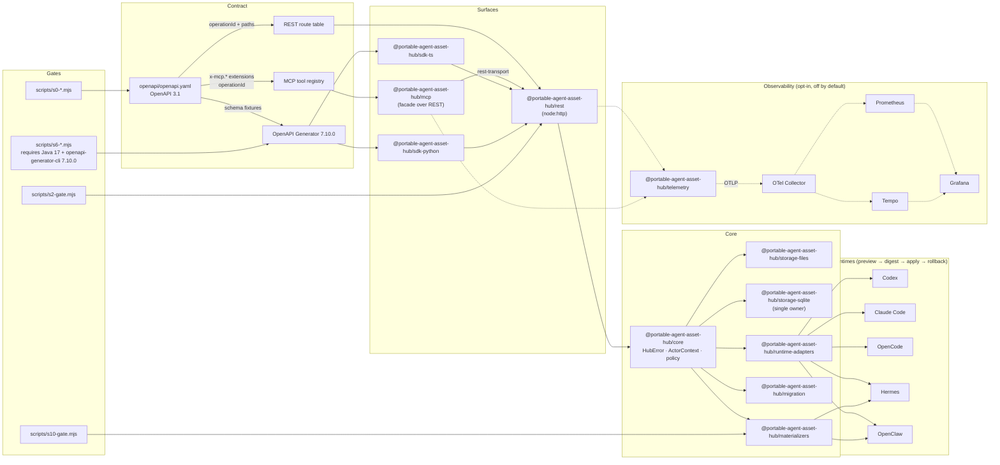

# Portable Agent Asset Hub

Portable, auditable hub for versioned agent assets and runtime materialization.

One canonical OpenAPI contract drives every surface: a REST API, an MCP stdio
facade, a TypeScript and Python SDK pair, and runtime adapters that attach the
same hub to **five agent runtimes — Codex, Claude Code, OpenCode, Hermes and
OpenClaw** — under one `preview → digest → apply → rollback` lifecycle.

That is the point of the project. Agent assets today are per-tool: skills live
in one harness's directory layout, in another's config format, and nothing
reconciles them. Here the assets live once in SQLite, versioned and auditable,
and each runtime is a *projection* of that authority rather than a fork of it.
Adding a sixth runtime means writing a renderer, not another source of truth.

It is published as a portfolio and research artifact: reproducible,
fail-closed, and explicitly not a hosted service.

## Badges

| Badge | Source |
| --- | --- |
| CI | [](https://github.com/dcosodev/portable-agent-asset-hub/actions/workflows/ci.yml) |
| License | [Apache-2.0](LICENSE) |
| Node engine | `>=22.16.0` (see `package.json` `engines.node`) |
| pnpm | `11.0.8` (see `package.json` `packageManager`) |
| TypeScript | `^5.8.2` (devDependency) |
| Project status | Portfolio / research, not a hosted service |

> CI runs the documentation contract, `lint` (root and `graph-ui`),
> `typecheck`, `test`, the OpenAPI drift gate, the static observability and
> Docker-stack contracts, MCP metadata reproducibility, and the end-to-end
> demo. What stays local is what needs something CI does not have: the
> staged gates (`s0`–`s10`), `pnpm docker:smoke` (a running Docker daemon),
> and the S6 SDK generation (Java 17 and OpenAPI Generator `7.10.0`).
> Missing external tools are reported as blockers, never silently downgraded.

## At a glance

- **OpenAPI 3.1 contract** under [`openapi/openapi.yaml`](openapi/openapi.yaml)
  with 51 operations across health, capabilities, identity, profiles, memories,
  memory blocks, events, skills, skill resources, the skill graph, mandatory
  retrieval, relation proposals, explicit relation candidates, catalog, audit,
  snapshots, replay, materializations, and bindings. (The file is
  JSON-formatted — valid YAML — and its path is pinned by the drift detector
  and the generated SDKs' `PROVENANCE.json`, so it keeps the `.yaml` name.)
- **REST surface** at `/api/v1/...` (`@portable-agent-asset-hub/rest`) using
  the standard `node:http` server, with bearer auth, optional loopback
  `localMode`, `If-Match` CAS enforcement on mutating routes, `x-request-id`
  propagation, and structured `HubError` responses.
- **MCP facade** (`@portable-agent-asset-hub/mcp`) that derives its tool
  registry from the OpenAPI `x-mcp.*` extensions, so every exposed tool maps
  1:1 to a REST operation and a declared MCP capability / safety class.
- **TypeScript and Python SDKs** generated from the same contract
  (`typescript-fetch` and `python`, OpenAPI Generator `7.10.0`), with a
  shared `PROVENANCE.json` per tree and pinned `contract_fixtures/`.
- **Skills as first-class assets**: DB-owned skill entries, immutable integer
  versions, byte-exact resources, and a skill-pack importer with secret
  scanning. SQLite is the authority; `SKILL.md` is never relation truth.
- **Versioned skill graph and mandatory retrieval**
  (`docs/skill-graph-retrieval.md`): eight canonical relation types, bounded
  structural expansion, immutable version resolution, and an append-only
  `retrieval_events` audit with a redacted query.
- **Governed relation proposals** (`docs/skill-relations.md`,
  `docs/relation-proposal-workflow.md`): discovery and explicit
  `related_skills` metadata produce *candidates*, never canonical edges. Review
  → apply-preview → plan digest → governed apply is the only path into
  `skill_relations`.
- **Materializers** (`@portable-agent-asset-hub/materializers`) for Hermes
  (`./hermes`) and OpenClaw (`./openclaw`) with `preview`, `apply`, and
  `rollback` lifecycles driven by versioned manifests and a CAS-based lock.
- **Runtime adapters** (`@portable-agent-asset-hub/runtime-adapters`,
  `docs/runtime-adapters.md`) that attach a hub to Codex, Claude Code,
  OpenCode, Hermes or OpenClaw under the same preview → digest → apply →
  rollback contract.
- **Skill export** (`@portable-agent-asset-hub/skill-export`) producing
  deterministic focal and full exports with canonical relation manifests.
- **Web Graph Explorer** (`@portable-agent-asset-hub/graph-ui`,
  `docs/web-graph-explorer.md`): a read-mostly React/Cytoscape projection
  served by a BFF. It never opens SQLite; the only writes it forwards are an
  anchored allowlist of governed relation proposal actions on loopback.
  Serving to a private LAN is opt-in and refuses every mutation.
- **Migration surface** (`@portable-agent-asset-hub/migration`) with
  classifier, redactor, cutover, replay, retirement, and shadow flows.
- **Operational telemetry** (`@portable-agent-asset-hub/telemetry`,
  `docs/observability.md`): an opt-in OpenTelemetry side channel, off by
  default and fail-open, with a portable Docker stack (Collector, Prometheus,
  Tempo, Grafana) under [`observability/`](observability/). It never replaces
  the durable audit trail.
- **Storage adapters** under `@portable-agent-asset-hub/storage-files` and
  `@portable-agent-asset-hub/storage-sqlite` (single SQLite owner per
  `docs/adr/0001-single-sqlite-owner.md`).
- **Staged gates S0–S10** as local Node scripts in [`scripts/`](scripts/) with
  per-invocation evidence under `artifacts/.evidence/` (Git-ignored).

## Architecture and data flow



The hub is read through three client channels — REST, MCP stdio, and the
generated SDKs — but writes always pass through the same core dispatcher, the
same storage adapters, and the same materializer contracts.

Five runtimes hang off one adapter package rather than five integrations. Each
is a renderer over the same plan: `computePreview` produces a digest, `applyPlan`
refuses to act on a stale one, and `rollbackPlan` undoes exactly what was
applied. A runtime never reaches SQLite, and adding one adds a renderer, not a
source of truth.

The dotted edges are the telemetry side channel. It is drawn separately because
it is separate: off unless an operator opts in, a noop when unreachable, and
never a substitute for the durable audit trail. Nothing on the solid path
changes behavior based on whether it is running.

## Package responsibilities

| Package | Role | Notes |
| --- | --- | --- |
| `@portable-agent-asset-hub/core` | Domain types, `HubError`, `ActorContext`, policy, event emission, core dispatch. | The only package allowed to own SQLite (see ADR 0001). |
| `@portable-agent-asset-hub/rest` | `node:http` server exposing `/api/v1/...` from the OpenAPI route table. | `createApp`, `createRestServer`, `listen`; bearer auth, loopback `localMode`, `If-Match` CAS, `x-request-id` propagation. |
| `@portable-agent-asset-hub/mcp` | MCP server facade. Never opens a database; talks to REST through `rest-transport.ts`. | Tool registry derived from `x-mcp.exposed`, `x-mcp.capability`, `x-mcp.safety`. |
| `@portable-agent-asset-hub/materializers` | Hermes (`./hermes`) and OpenClaw (`./openclaw`) materializers with `preview`, `apply`, `rollback`. | Manifest v1 schema under `src/manifest.v1.json`; CAS-based lock per run. |
| `@portable-agent-asset-hub/migration` | Migration / cutover surface: classifier, redactor, shadow, replay, retirement. | Operates on the same core and storage adapters. |
| `@portable-agent-asset-hub/storage-files` | Filesystem-backed storage adapter. | Used for portable fixtures. |
| `@portable-agent-asset-hub/storage-sqlite` | SQLite-backed storage adapter (the single owner). | See `docs/adr/0001-single-sqlite-owner.md`. |
| `@portable-agent-asset-hub/runtime-adapters` | Attaches a hub to Codex, Claude Code, OpenCode, Hermes and OpenClaw. | `computePreview` / `applyPlan` / `rollbackPlan`; path containment, safe file modes, no secrets in descriptors. See `docs/runtime-adapters.md`. |
| `@portable-agent-asset-hub/skill-export` | Deterministic focal and full skill export with canonical relation manifests. | Proposals are staging data and are never exported as canonical graph data. |
| `@portable-agent-asset-hub/graph-ui` | Read-mostly Web Graph Explorer (React, Vite, Cytoscape.js) plus its BFF. | Strictly a REST client; never opens SQLite. Forwards only allowlisted governed relation actions, and none in LAN mode. See `docs/web-graph-explorer.md`. |
| `@portable-agent-asset-hub/telemetry` | Opt-in OpenTelemetry kernel: config parsing, bounded attributes, redaction, noop fallback. | Off by default and fail-open; never a substitute for audit. See `docs/observability.md`. |
| `@portable-agent-asset-hub/sdk-ts` | Generated TypeScript SDK (`typescript-fetch`). | Source of truth is `openapi/openapi.yaml`; `generated/PROVENANCE.json` records the pinned tool. |
| `@portable-agent-asset-hub/sdk-python` | Generated Python SDK (`python`). | Same generator, same pinned version, same contract fixtures. |

## API surface at a glance

The 51 operations defined in `openapi/openapi.yaml`, grouped by MCP capability
and safety class. Safety classes follow the OpenAPI `x-mcp.safety` extension:
`safe`, `mutating`, `destructive`, or `diagnostic`. The "MCP tool" column
reflects `x-mcp.exposed`: 34 operations are exposed as MCP tools; the graph and
retrieval-explorer reads are a human REST surface and are deliberately not.

| Method | Path | operationId | MCP capability | Safety | CAS | Idempotent | MCP tool |
| --- | --- | --- | --- | --- | --- | --- | --- |
| GET | `/api/v1/health` | `getHealth` | `health.read` | safe | — | — | yes |
| GET | `/api/v1/status` | `getStatus` | `status.read` | safe | — | — | yes |
| GET | `/api/v1/capabilities` | `getCapabilities` | `capabilities.read` | safe | — | — | yes |
| GET | `/api/v1/admin/doctor` | `getDoctor` | `admin.doctor` | diagnostic | — | — | yes |
| GET | `/api/v1/identities` | `listIdentities` | `identity.read` | safe | — | — | yes |
| POST | `/api/v1/bindings` | `createBinding` | `binding.write` | mutating | yes | yes | yes |
| POST | `/api/v1/profiles` | `createProfile` | `profile.write` | mutating | — | yes | yes |
| GET | `/api/v1/memory-blocks` | `listMemoryBlocks` | `memory.read` | safe | — | — | yes |
| POST | `/api/v1/events` | `createEvent` | `event.write` | mutating | — | yes | yes |
| GET | `/api/v1/memories/search` | `searchMemories` | `memory.read` | safe | — | — | yes |
| GET | `/api/v1/memories/{id}` | `getMemory` | `memory.read` | safe | — | — | yes |
| POST | `/api/v1/memories` | `createMemory` | `memory.write` | mutating | — | yes | yes |
| POST | `/api/v1/memories/{id}/supersede` | `supersedeMemory` | `memory.supersede` | mutating | yes | yes | yes |
| POST | `/api/v1/memories/{id}/forget` | `forgetMemory` | `memory.forget` | destructive | yes | yes | yes |
| GET | `/api/v1/skills/search` | `searchSkills` | `skill.read` | safe | — | — | yes |
| GET | `/api/v1/skills/{id}` | `getSkill` | `skill.read` | safe | — | — | yes |
| GET | `/api/v1/skills/{id}/resources` | `listSkillResources` | `skill.resource.read` | safe | — | — | yes |
| GET | `/api/v1/skills/{id}/resources/{resourcePath}` | `readSkillResource` | `skill.resource.read` | safe | — | — | yes |
| GET | `/api/v1/resources/{path}` | `getResource` | `resource.read` | safe | — | — | yes |
| GET | `/api/v1/catalog/search` | `searchCatalog` | `catalog.read` | safe | — | — | yes |
| GET | `/api/v1/catalog` | `getCatalog` | `catalog.read` | safe | — | — | yes |
| POST | `/api/v1/catalog/sync/preview` | `previewCatalogSync` | `catalog.sync.preview` | mutating | — | yes | yes |
| POST | `/api/v1/catalog/sync/apply` | `applyCatalogSync` | `catalog.sync.apply` | mutating | yes | yes | yes |
| GET | `/api/v1/audit` | `listAudit` | `audit.read` | safe | — | — | yes |
| GET | `/api/v1/snapshots` | `listSnapshots` | `snapshot.read` | safe | — | — | yes |
| POST | `/api/v1/replay` | `replay` | `replay.run` | diagnostic | — | yes | yes |
| POST | `/api/v1/materializations/preview` | `previewMaterialization` | `materialization.preview` | safe | — | yes | yes |
| POST | `/api/v1/materializations/apply` | `applyMaterialization` | `materialization.apply` | mutating | yes | yes | yes |
| POST | `/api/v1/materializations/{run_id}/rollback` | `rollbackMaterialization` | `materialization.rollback` | destructive | yes | yes | yes |
| GET | `/api/v1/skills/{id}/relations` | `getSkillRelations` | `skill.read` | safe | — | — | yes |
| PUT | `/api/v1/skills/{id}/relations` | `replaceSkillRelations` | `write.skill` | mutating | yes | yes | yes |
| GET | `/api/v1/skills/{id}/dependents` | `getSkillDependents` | `skill.read` | safe | — | — | yes |
| POST | `/api/v1/skills/resolve` | `resolveSkillGraph` | `skill.read` | safe | — | — | yes |
| POST | `/api/v1/retrieval/resolve` | `resolveRetrieval` | `skill.read` | safe | — | — | yes |
| GET | `/api/v1/graph/skills` | `getGlobalSkillGraph` | `skill.read` | safe | — | yes | no |
| GET | `/api/v1/skills/{id}/graph` | `getSkillGraph` | `skill.read` | safe | — | yes | no |
| GET | `/api/v1/skills/{id}/impact` | `getSkillImpact` | `skill.read` | safe | — | yes | no |
| GET | `/api/v1/retrieval-events` | `listRetrievalEvents` | `skill.read` | safe | — | yes | no |
| GET | `/api/v1/retrieval-events/{id}/graph` | `getRetrievalEventGraph` | `skill.read` | safe | — | yes | no |
| GET | `/api/v1/skill-relation-proposals` | `listSkillRelationProposals` | `skill.relation.proposal.read` | safe | — | — | no |
| POST | `/api/v1/skill-relation-proposals` | `createManualSkillRelationProposal` | `skill.relation.proposal.create` | mutating | yes | yes | no |
| GET | `/api/v1/skill-relation-proposals/{id}` | `getSkillRelationProposal` | `skill.relation.proposal.read` | safe | — | — | no |
| POST | `/api/v1/skill-relation-proposals/discover` | `discoverSkillRelationProposals` | `skill.relation.proposal.create` | safe | — | — | no |
| POST | `/api/v1/skill-relation-proposals/{id}/approve` | `approveSkillRelationProposal` | `skill.relation.proposal.review` | mutating | yes | — | no |
| POST | `/api/v1/skill-relation-proposals/{id}/reject` | `rejectSkillRelationProposal` | `skill.relation.proposal.review` | mutating | yes | — | no |
| POST | `/api/v1/skill-relation-proposals/apply-preview` | `previewSkillRelationProposalApply` | `skill.relation.proposal.apply` | safe | — | — | no |
| POST | `/api/v1/skill-relation-proposals/reconcile-canonical-duplicates` | `reconcileSkillRelationProposalDuplicates` | `skill.relation.proposal.reconcile` | mutating | yes | yes | no |
| POST | `/api/v1/skill-relation-proposals/apply` | `applySkillRelationProposals` | `skill.relation.proposal.apply` | mutating | yes | — | no |
| GET | `/api/v1/skill-relation-candidates/explicit` | `listExplicitSkillRelationCandidates` | `skill.relation.candidate.read` | safe | — | yes | no |
| POST | `/api/v1/skill-relation-candidates/explicit/impact` | `previewExplicitSkillRelationCandidatesImpact` | `skill.relation.candidate.read` | safe | — | yes | no |
| POST | `/api/v1/skill-relation-candidates/explicit/stage` | `stageExplicitSkillRelationCandidates` | `skill.relation.candidate.stage` | mutating | yes | yes | no |

> "CAS" indicates `x-cas-required: true` in the OpenAPI contract and means
> the REST server will reject the request with `428 PRECONDITION_REQUIRED`
> when the caller does not supply a matching `If-Match` header.
> "Idempotent" mirrors the `x-idempotent` extension and signals operations
> that are safe to retry under the core's idempotency tracking.

### Removed in 0.2.0

`listSkills` (`GET /api/v1/skills`) and `listSkillVersions`
(`GET /api/v1/skills/{id}/versions`) were removed. The canonical skill surface
is now read-only and consists of `searchSkills`, `getSkill`,
`listSkillResources` and `readSkillResource`. The corresponding MCP tools
`list_skills` and `list_skill_versions` disappear with them, so a client that
hardcodes those names will fail at tool discovery. See [`CHANGELOG.md`](CHANGELOG.md).

## Quickstart

```sh
# 1. Install workspace dependencies.
pnpm install

# 2. Build the TypeScript workspace.
pnpm build

# 3. Run the local fast-checks (see "Validation" below).
pnpm docs:check
pnpm lint
pnpm typecheck
pnpm test

# 4. Watch the hub work end to end (profile -> preview -> apply ->
#    drift 412 -> rollback), fully local. See docs/demo.md.
node examples/demo/demo.mjs

# 5. Optional: browse the canonical skill graph.
#    Needs a running REST hub; see docs/web-graph-explorer.md.
pnpm graph-ui

# 6. Optional: bring up the local observability stack (Collector,
#    Prometheus, Tempo, Grafana). Needs Docker; see observability/README.md.
docker compose -f observability/compose.yaml up -d
```

> `pnpm test` is preceded by `pnpm build` (`pretest` hook). It runs
> `vitest run` against the contract, integration, E2E, and gate test files
> under [`tests/`](tests/), then the `graph-ui` suite through
> `pnpm --filter`. `graph-ui` is deliberately outside the root `tsconfig.json`
> project references — it compiles JSX under its own `tsconfig.json` and
> `tsconfig.server.json` — so it always needs that separate leg.

> Node prints `ExperimentalWarning: SQLite is an experimental feature`
> during tests: the storage adapter uses the built-in `node:sqlite` module,
> which is experimental on the supported Node >= 22.16 line. The warning is
> expected and harmless; the limitation is recorded explicitly in the gate
> evidence rather than suppressed.

## Validation

The repository ships two classes of validation:

### Local fast checks

| Command | Purpose |
| --- | --- |
| `pnpm docs:check` | Documentation contract: promised documents exist, relative links resolve, no stale schema or contract claims. |
| `pnpm lint` | ESLint over the workspace (`--max-warnings 0`). |
| `pnpm typecheck` | `tsc -b` across the project references, then `graph-ui`. |
| `pnpm test` | Builds first (`pretest`), then runs the vitest suite and the `graph-ui` suite. |
| `pnpm build` | Cleans `dist/`, runs `tsc -b --force`, copies S2 migrations, builds `graph-ui`. |
| `pnpm audit` | `pnpm audit --prod` over the production dependency set. |
| `pnpm baseline:audit` | `node scripts/s0-audit.mjs` over the public fixture. |
| `pnpm pack` | `node scripts/s0-pack.mjs` (publishable tarball). |
| `pnpm observability:lint` | Static contract over the telemetry kernel: bounded attributes, no unredacted values. |
| `pnpm observability:contract` | Privacy, cardinality, fail-open, config and noop behavior of the telemetry kernel. |
| `pnpm docker:contract` | Static read of the Compose and Collector configuration. No daemon required. |
| `pnpm docker:smoke` | Builds both images and drives the live stack end to end. **Requires Docker.** |

### Staged gates (S0–S10)

The staged gates run fail-closed against the workspace and write per-invocation
evidence under `artifacts/.evidence/`. They are local scripts and do not
require a CI service.

| Stage | Script | Purpose |
| --- | --- | --- |
| S0 | `pnpm s0:gate` / `pnpm baseline:audit` / `pnpm pack` | Public-surface policy, baseline tarball, and pack reproducibility. |
| S2 | `pnpm s2:gate` / `pnpm s2:package-repro` / `pnpm s2:external-install` / `pnpm s2:fresh-backup` | Contract, package reproducibility, external install, and fresh backup. |
| S3 | `pnpm s3:gate` / `pnpm s3:external-install` | Memory and schema gates. |
| S4 | `pnpm s4:gate` | Profile and materialization red-contracts. |
| S5 | `pnpm s5:gate` / `pnpm s5:fresh-process` | Fresh-process materialization and integrity. |
| S6 | `pnpm s6:generate` / `pnpm s6:drift` / `pnpm s6:gate` | SDK generation and OpenAPI drift. **Requires Java 17 + OpenAPI Generator 7.10.0.** |
| S7 | `pnpm s7:gate` | Downstream SDK smoke checks. |
| S8 | `pnpm s8:gate` | Cross-package integration evidence. |
| S9 | `pnpm s9:gate` | Long-horizon evidence assembly. |
| S10 | `pnpm s10:gate` | Migration safety, replay, and retirement. |

S6 is intentionally fail-closed when Java or the exact OpenAPI Generator
version is unavailable. Generated SDKs must never be replaced with
placeholders; the `PROVENANCE.json` per SDK tree records the pinned tool,
version, and source contract.

### Evidence layout

Gate artifacts are written under `artifacts/`. Per-invocation snapshots and
stdout/stderr logs are written under `artifacts/.evidence/` and are ignored
by Git. A failed invocation remains a failure even if a later nested
regression passes; later runs have separate IDs and evidence paths.

## Project status

This is a **portfolio / research** project, not a hosted service and not a
promise of production support. The current public export has been validated
through S6, including SDK generation, REST/MCP checks, and package
reproducibility. The suite is 561 tests (541 in the workspace plus 20 in
`graph-ui`). The S0 gate enforces a public-surface policy that excludes
personal skills, profiles, credentials, sessions, and runtime state.

### Implemented

- OpenAPI 3.1 contract with 51 operations, `x-mcp.*` extensions, and drift
  detection (`pnpm s6:drift`).
- REST surface at `/api/v1/...` with bearer auth, loopback `localMode`,
  `If-Match` CAS, and structured `HubError` responses.
- MCP facade with a tool registry derived from the OpenAPI contract; the
  MCP server has no local database and no local-mode fallback.
- TypeScript and Python SDK generation with OpenAPI Generator 7.10.0,
  pinned per-language `PROVENANCE.json`, and shared `contract_fixtures/`.
- Hermes and OpenClaw materializers under
  `@portable-agent-asset-hub/materializers` with `preview`, `apply`, and
  `rollback` lifecycles.
- Skills as DB-owned assets: immutable integer versions, byte-exact
  resources, catalog FTS, and a skill-pack importer with secret scanning
  (migrations 0014–0016).
- Versioned skill graph and mandatory retrieval with an append-only,
  redacted `retrieval_events` audit (`docs/skill-graph-retrieval.md`).
- Governed relation proposals and explicit `related_skills` candidates:
  discovery suggests, review decides, only a matching plan digest applies
  (migrations 0018–0019, `docs/skill-relations.md`).
- Runtime adapters for Codex, Claude Code, OpenCode, Hermes and OpenClaw
  (`docs/runtime-adapters.md`).
- Deterministic focal and full skill export
  (`@portable-agent-asset-hub/skill-export`).
- Read-only Web Graph Explorer behind a loopback BFF
  (`docs/web-graph-explorer.md`).
- Runtime credential bindings and the `GET /api/v1/capabilities` handshake
  (migration 0017).
- Migration surface: classifier, redactor, shadow, replay, retirement,
  and cutover.
- Storage adapters under `@portable-agent-asset-hub/storage-files` and
  `@portable-agent-asset-hub/storage-sqlite` (single owner per ADR 0001).
- Staged gates S0–S10 as local fail-closed scripts with per-invocation
  evidence.

### Not implemented (in this public export)

- A hosted service, a managed runtime, or any kind of SLA.
- A persistent log store. The observability stack ships Collector,
  Prometheus, Tempo and Grafana; log retention needs a privacy review and a
  retention policy this stack does not yet have.
- Automatic approval of relation candidates. Migration 0020 records approval
  provenance and two closed-by-default eligibility gates exist, but nothing
  wires them: human review remains the only path to a canonical relation.
- CI coverage of the staged gates: the GitHub Actions workflow runs the
  fast checks and the demo only; gates `s0`–`s10` are local scripts.
- Personal skills, profiles, cookies, tokens, sessions, `state.db`, or
  other runtime data. The public fixture under
  `docs/baseline/public-fixture/` contains neutral example data only.
- A public security contact configured for response-SLA reports. See
  [`SECURITY.md`](SECURITY.md).

## Security and privacy boundary

The hub is a contract-first system: every external request flows through
the OpenAPI contract, the REST surface enforces bearer auth or
loopback-local mode, and writes that need optimistic concurrency require
an `If-Match` header (`x-cas-required: true`). Mutating operations are
tracked for idempotency at the core layer.

This public repository contains the portable hub implementation and
neutral fixtures. It does **not** contain a user's private Hermes skills,
profiles, cookies, tokens, sessions, `state.db`, or other runtime data.
A private deployment can use the hub as a canonical source and materialize
selected assets into a local runtime through an explicit adapter.

Do not publish secrets, private runtime data, or developer-specific
absolute paths in issues or pull requests. See
[`SECURITY.md`](SECURITY.md) and [`CONTRIBUTING.md`](CONTRIBUTING.md).

## Development workflow

1. Run the local fast checks: `pnpm docs:check`, `pnpm lint`, `pnpm typecheck`, `pnpm test`.
2. Touching a contract? Regenerate SDKs with `pnpm s6:generate` (requires
   Java 17 and OpenAPI Generator 7.10.0) and confirm `pnpm s6:drift` is
   clean. Do not edit the generated SDKs manually.
3. Touching a staged surface? Run the relevant gate and include the
   fresh exit code plus a concise artifact summary in the PR.
4. Keep changes focused and reversible. Do not commit `node_modules/`,
   `dist/`, `artifacts/`, `.tmp-*`, credentials, private runtime state, or
   local caches.

The PR template under `.github/PULL_REQUEST_TEMPLATE.md` mirrors this
checklist.

## Project layout

- `openapi/` — canonical API contract (`openapi.yaml` + `components/`).
- `packages/core/` — domain types, `HubError`, `ActorContext`, policy, core
  dispatch.
- `packages/rest/` — REST surface (`createApp`, `createRestServer`,
  `listen`).
- `packages/mcp/` — MCP facade and generated tool metadata.
- `packages/materializers/` — Hermes and OpenClaw materializer contracts.
- `packages/runtime-adapters/` — Codex, Claude Code, OpenCode, Hermes and
  OpenClaw attach adapters.
- `packages/skill-export/` — deterministic skill export.
- `packages/graph-ui/` — read-only Web Graph Explorer and its loopback BFF.
- `packages/migration/` — migration and cutover surface.
- `packages/storage-files/`, `packages/storage-sqlite/` — storage adapters
  (single owner per ADR 0001).
- `packages/sdk-ts/`, `packages/sdk-python/` — generated SDKs.
- `schemas/` — JSON-Schema fixtures used by the contract, gates, and SDK
  tests.
- `scripts/` — generators, drift checks, and staged gates.
- `tests/` — contract, integration, E2E, and gate tests.
- `slices/` — scoped contract spikes and provenance records (see
  [`slices/README.md`](slices/README.md)).
- `integrations/openclaw/` — OpenClaw integration fixtures.
- `migrations/manifests/` — S2 migration manifests.
- `docs/adr/` — Architecture Decision Records.
- `docs/baseline/` — public baseline fixture and manifest.
- `artifacts/` — gate evidence (Git-ignored for `.evidence/`).

## Related documentation

- [`CHANGELOG.md`](CHANGELOG.md) — public release notes.
- [`CONTRIBUTING.md`](CONTRIBUTING.md) — contribution and PR checklist.
- [`CODE_OF_CONDUCT.md`](CODE_OF_CONDUCT.md) — community standards.
- [`SECURITY.md`](SECURITY.md) — vulnerability reporting and supported
  versions.
- [`THIRD_PARTY_NOTICES.md`](THIRD_PARTY_NOTICES.md) and
  `third_party/licenses/` — third-party attributions.
- [`docs/adr/0001-single-sqlite-owner.md`](docs/adr/0001-single-sqlite-owner.md)
  — why one package owns SQLite.
- [`docs/adr/0002-portable-v1-exclusions.md`](docs/adr/0002-portable-v1-exclusions.md)
  — what the portable v1 contract explicitly leaves out.
- [`docs/adr/0003-tencent-extraction-boundary.md`](docs/adr/0003-tencent-extraction-boundary.md)
  — extraction boundary for upstream material.
- [`docs/architecture.md`](docs/architecture.md) — the current system map,
  per-subsystem implementation table, and relation flow.
- [`docs/skill-graph-retrieval.md`](docs/skill-graph-retrieval.md) — the
  versioned skill graph, relation semantics, and mandatory retrieval.
- [`docs/skill-relations.md`](docs/skill-relations.md) — the single
  relation-model document: authority, proposals, explicit metadata, discovery.
- [`docs/relation-proposal-workflow.md`](docs/relation-proposal-workflow.md)
  — the governed discovery → review → preview → apply lifecycle.
- [`docs/runtime-adapters.md`](docs/runtime-adapters.md) — attaching a hub to
  Codex, Claude Code, OpenCode, Hermes or OpenClaw.
- [`docs/web-graph-explorer.md`](docs/web-graph-explorer.md) — the read-only
  graph UI, its loopback BFF, and its security posture.
- [`docs/canonical-storage.md`](docs/canonical-storage.md) — storage-mode
  resolution, canonical vs temporary, backup and doctor.
- [`docs/demo.md`](docs/demo.md) — the end-to-end walkthrough
  (`examples/demo/demo.mjs`) and SDK usage snippets.
- [`docs/engineering-log.md`](docs/engineering-log.md) — staged-gate
  methodology, glossary, and the consolidated RED/GREEN log per stage.
- [`docs/s2-contract.md`](docs/s2-contract.md) — S2 contract notes.
- [`slices/README.md`](slices/README.md) — what a slice/spike is and the
  S1 go/no-go outcome.
- [`docs/upstream-reuse.yaml`](docs/upstream-reuse.yaml) — upstream reuse
  manifest.

## Community and license

Copyright 2026 Daniel C. S.

This project is licensed under the Apache License, Version 2.0. See
[`LICENSE`](LICENSE).

Third-party components and copied schema material retain their own notices
and licenses. See [`THIRD_PARTY_NOTICES.md`](THIRD_PARTY_NOTICES.md) and
`third_party/licenses/`. The [`NOTICE`](NOTICE) file at the repository
root carries the upstream attribution statement.

Please do not publish secrets or private runtime data in issues or pull
requests. There is no hosted service, no managed runtime, and no response
SLA. Bug reports should use the
[bug report template](.github/ISSUE_TEMPLATE/bug_report.md); feature
requests should use the
[feature request template](.github/ISSUE_TEMPLATE/feature_request.md).

---

<sub>History squashed at open-sourcing; developed privately before the initial public release.</sub>
