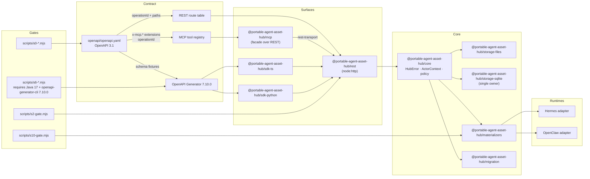

# Portable Agent Asset Hub

Portable, auditable hub for versioned agent assets and runtime materialization.

The hub exposes a canonical OpenAPI contract that drives a REST surface, an MCP
facade, a TypeScript and Python SDK pair, and versioned materializers for
supported agent runtimes (Hermes and OpenClaw). It is published as a portfolio
and research artifact: the implementation is reproducible, fail-closed, and
explicitly not a hosted service.

## Badges

| Badge | Source |
| --- | --- |
| CI | [](https://github.com/dcosodev/portable-agent-asset-hub/actions/workflows/ci.yml) |
| License | [Apache-2.0](LICENSE) |
| Node engine | `>=22.16.0` (see `package.json` `engines.node`) |
| pnpm | `11.0.8` (see `package.json` `packageManager`) |
| TypeScript | `^5.8.2` (devDependency) |
| Project status | Portfolio / research, not a hosted service |

> CI runs the fast checks only (`lint`, `typecheck`, `test`, and the
> end-to-end demo). The staged gates (`s0`–`s10`) remain local, fail-closed
> scripts. The S6 SDK-generation gate additionally requires Java 17 and
> OpenAPI Generator `7.10.0`; missing external tools are reported as
> blockers, not silently downgraded.

## At a glance

- **OpenAPI 3.1 contract** under [`openapi/openapi.yaml`](openapi/openapi.yaml)
  with 23 operations across health, identity, profiles, memories, memory
  blocks, events, skills, resources, catalog, audit, snapshots, replay,
  materializations, and bindings. (The file is JSON-formatted — valid YAML —
  and its path is pinned by the drift detector and the generated SDKs'
  `PROVENANCE.json`, so it keeps the `.yaml` name.)
- **REST surface** at `/api/v1/...` (`@portable-agent-asset-hub/rest`) using
  the standard `node:http` server, with bearer auth, optional loopback
  `localMode`, `If-Match` CAS enforcement on mutating routes, `x-request-id`
  propagation, and structured `HubError` responses.
- **MCP facade** (`@portable-agent-asset-hub/mcp`) that derives its tool
  registry from the OpenAPI `x-mcp.*` extensions, so every exposed tool maps
  1:1 to a REST operation and a declared MCP capability / safety class.
- **TypeScript and Python SDKs** generated from the same contract
  (`typescript-fetch` and `python`, OpenAPI Generator `7.10.0`), with a
  shared `PROVENANCE.json` per tree and pinned `contract_fixtures/`.
- **Materializers** (`@portable-agent-asset-hub/materializers`) for Hermes
  (`./hermes`) and OpenClaw (`./openclaw`) with `preview`, `apply`, and
  `rollback` lifecycles driven by versioned manifests and a CAS-based lock.
- **Migration surface** (`@portable-agent-asset-hub/migration`) with
  classifier, redactor, cutover, replay, retirement, and shadow flows.
- **Storage adapters** under `@portable-agent-asset-hub/storage-files` and
  `@portable-agent-asset-hub/storage-sqlite` (single SQLite owner per
  `docs/adr/0001-single-sqlite-owner.md`).
- **Staged gates S0–S10** as local Node scripts in [`scripts/`](scripts/) with
  per-invocation evidence under `artifacts/.evidence/` (Git-ignored).

## Architecture and data flow



The hub is read through three client channels — REST, MCP, and the generated
SDKs — but writes always pass through the same core dispatcher, the same
storage adapters, and the same materializer contracts.

## Package responsibilities

| Package | Role | Notes |
| --- | --- | --- |
| `@portable-agent-asset-hub/core` | Domain types, `HubError`, `ActorContext`, policy, event emission, core dispatch. | The only package allowed to own SQLite (see ADR 0001). |
| `@portable-agent-asset-hub/rest` | `node:http` server exposing `/api/v1/...` from the OpenAPI route table. | `createApp`, `createRestServer`, `listen`; bearer auth, loopback `localMode`, `If-Match` CAS, `x-request-id` propagation. |
| `@portable-agent-asset-hub/mcp` | MCP server facade. Never opens a database; talks to REST through `rest-transport.ts`. | Tool registry derived from `x-mcp.exposed`, `x-mcp.capability`, `x-mcp.safety`. |
| `@portable-agent-asset-hub/materializers` | Hermes (`./hermes`) and OpenClaw (`./openclaw`) materializers with `preview`, `apply`, `rollback`. | Manifest v1 schema under `src/manifest.v1.json`; CAS-based lock per run. |
| `@portable-agent-asset-hub/migration` | Migration / cutover surface: classifier, redactor, shadow, replay, retirement. | Operates on the same core and storage adapters. |
| `@portable-agent-asset-hub/storage-files` | Filesystem-backed storage adapter. | Used for portable fixtures. |
| `@portable-agent-asset-hub/storage-sqlite` | SQLite-backed storage adapter (the single owner). | See `docs/adr/0001-single-sqlite-owner.md`. |
| `@portable-agent-asset-hub/sdk-ts` | Generated TypeScript SDK (`typescript-fetch`). | Source of truth is `openapi/openapi.yaml`; `generated/PROVENANCE.json` records the pinned tool. |
| `@portable-agent-asset-hub/sdk-python` | Generated Python SDK (`python`). | Same generator, same pinned version, same contract fixtures. |

## API surface at a glance

The 23 operations currently defined in `openapi/openapi.yaml`, grouped by
MCP capability / safety class. Safety classes follow the OpenAPI
`x-mcp.safety` extension: `safe`, `mutating`, `destructive`, or
`diagnostic`.

| Method | Path | operationId | MCP capability | Safety | CAS | Idempotent |
| --- | --- | --- | --- | --- | --- | --- |
| GET | `/api/v1/health` | `getHealth` | `health.read` | safe | — | — |
| GET | `/api/v1/status` | `getStatus` | `status.read` | safe | — | — |
| GET | `/api/v1/admin/doctor` | `getDoctor` | `admin.doctor` | diagnostic | — | — |
| GET | `/api/v1/identities` | `listIdentities` | `identity.read` | safe | — | — |
| POST | `/api/v1/bindings` | `createBinding` | `binding.write` | mutating | yes | yes |
| POST | `/api/v1/profiles` | `createProfile` | `profile.write` | mutating | — | yes |
| GET | `/api/v1/memory-blocks` | `listMemoryBlocks` | `memory.read` | safe | — | — |
| POST | `/api/v1/events` | `createEvent` | `event.write` | mutating | — | yes |
| POST | `/api/v1/memories` | `createMemory` | `memory.write` | mutating | — | yes |
| POST | `/api/v1/memories/{id}/supersede` | `supersedeMemory` | `memory.supersede` | mutating | yes | yes |
| POST | `/api/v1/memories/{id}/forget` | `forgetMemory` | `memory.forget` | destructive | yes | yes |
| GET | `/api/v1/skills` | `listSkills` | `skill.read` | safe | — | — |
| GET | `/api/v1/skills/{id}/versions` | `listSkillVersions` | `skill.version.read` | safe | — | — |
| GET | `/api/v1/resources/{path}` | `getResource` | `resource.read` | safe | — | — |
| GET | `/api/v1/catalog` | `getCatalog` | `catalog.read` | safe | — | — |
| POST | `/api/v1/catalog/sync/preview` | `previewCatalogSync` | `catalog.sync.preview` | mutating | — | yes |
| POST | `/api/v1/catalog/sync/apply` | `applyCatalogSync` | `catalog.sync.apply` | mutating | yes | yes |
| GET | `/api/v1/audit` | `listAudit` | `audit.read` | safe | — | — |
| GET | `/api/v1/snapshots` | `listSnapshots` | `snapshot.read` | safe | — | — |
| POST | `/api/v1/replay` | `replay` | `replay.run` | diagnostic | — | yes |
| POST | `/api/v1/materializations/preview` | `previewMaterialization` | `materialization.preview` | safe | — | yes |
| POST | `/api/v1/materializations/apply` | `applyMaterialization` | `materialization.apply` | mutating | yes | yes |
| POST | `/api/v1/materializations/{run_id}/rollback` | `rollbackMaterialization` | `materialization.rollback` | destructive | yes | yes |

> "CAS" indicates `x-cas-required: true` in the OpenAPI contract and means
> the REST server will reject the request with `428 PRECONDITION_REQUIRED`
> when the caller does not supply a matching `If-Match` header.
> "Idempotent" mirrors the `x-idempotent` extension and signals operations
> that are safe to retry under the core's idempotency tracking.

## Quickstart

```sh
# 1. Install workspace dependencies.
pnpm install

# 2. Build the TypeScript workspace.
pnpm build

# 3. Run the local fast-checks (see "Validation" below).
pnpm lint
pnpm typecheck
pnpm test

# 4. Watch the hub work end to end (profile -> preview -> apply ->
#    drift 412 -> rollback), fully local. See docs/demo.md.
node examples/demo/demo.mjs
```

> `pnpm test` is preceded by `pnpm build` (`pretest` hook) and runs
> `vitest run` against the contract, integration, E2E, and gate test files
> under [`tests/`](tests/).

> Node prints `ExperimentalWarning: SQLite is an experimental feature`
> during tests: the storage adapter uses the built-in `node:sqlite` module,
> which is experimental on the supported Node >= 22.16 line. The warning is
> expected and harmless; the limitation is recorded explicitly in the gate
> evidence rather than suppressed.

## Validation

The repository ships two classes of validation:

### Local fast checks

| Command | Purpose |
| --- | --- |
| `pnpm lint` | ESLint over the workspace (`--max-warnings 0`). |
| `pnpm typecheck` | `tsc -b` across the project references. |
| `pnpm test` | Builds first (`pretest`), then runs the vitest suite. |
| `pnpm build` | Cleans `dist/`, runs `tsc -b --force`, copies S2 migrations. |
| `pnpm audit` | `pnpm audit --prod` over the production dependency set. |
| `pnpm baseline:audit` | `node scripts/s0-audit.mjs` over the public fixture. |
| `pnpm pack` | `node scripts/s0-pack.mjs` (publishable tarball). |

### Staged gates (S0–S10)

The staged gates run fail-closed against the workspace and write per-invocation
evidence under `artifacts/.evidence/`. They are local scripts and do not
require a CI service.

| Stage | Script | Purpose |
| --- | --- | --- |
| S0 | `pnpm s0:gate` / `pnpm baseline:audit` / `pnpm pack` | Public-surface policy, baseline tarball, and pack reproducibility. |
| S2 | `pnpm s2:gate` / `pnpm s2:package-repro` / `pnpm s2:external-install` / `pnpm s2:fresh-backup` | Contract, package reproducibility, external install, and fresh backup. |
| S3 | `pnpm s3:gate` / `pnpm s3:external-install` | Memory and schema gates. |
| S4 | `pnpm s4:gate` | Profile and materialization red-contracts. |
| S5 | `pnpm s5:gate` / `pnpm s5:fresh-process` | Fresh-process materialization and integrity. |
| S6 | `pnpm s6:generate` / `pnpm s6:drift` / `pnpm s6:gate` | SDK generation and OpenAPI drift. **Requires Java 17 + OpenAPI Generator 7.10.0.** |
| S7 | `pnpm s7:gate` | Downstream SDK smoke checks. |
| S8 | `pnpm s8:gate` | Cross-package integration evidence. |
| S9 | `pnpm s9:gate` | Long-horizon evidence assembly. |
| S10 | `pnpm s10:gate` | Migration safety, replay, and retirement. |

S6 is intentionally fail-closed when Java or the exact OpenAPI Generator
version is unavailable. Generated SDKs must never be replaced with
placeholders; the `PROVENANCE.json` per SDK tree records the pinned tool,
version, and source contract.

### Evidence layout

Gate artifacts are written under `artifacts/`. Per-invocation snapshots and
stdout/stderr logs are written under `artifacts/.evidence/` and are ignored
by Git. A failed invocation remains a failure even if a later nested
regression passes; later runs have separate IDs and evidence paths.

## Project status

This is a **portfolio / research** project, not a hosted service and not a
promise of production support. The current public export has been validated
through S6, including SDK generation, REST/MCP checks, and package
reproducibility. The S0 gate enforces a public-surface policy that excludes
personal skills, profiles, credentials, sessions, and runtime state.

### Implemented

- OpenAPI 3.1 contract with 23 operations, `x-mcp.*` extensions, and drift
  detection (`pnpm s6:drift`).
- REST surface at `/api/v1/...` with bearer auth, loopback `localMode`,
  `If-Match` CAS, and structured `HubError` responses.
- MCP facade with a tool registry derived from the OpenAPI contract; the
  MCP server has no local database and no local-mode fallback.
- TypeScript and Python SDK generation with OpenAPI Generator 7.10.0,
  pinned per-language `PROVENANCE.json`, and shared `contract_fixtures/`.
- Hermes and OpenClaw materializers under
  `@portable-agent-asset-hub/materializers` with `preview`, `apply`, and
  `rollback` lifecycles.
- Migration surface: classifier, redactor, shadow, replay, retirement,
  and cutover.
- Storage adapters under `@portable-agent-asset-hub/storage-files` and
  `@portable-agent-asset-hub/storage-sqlite` (single owner per ADR 0001).
- Staged gates S0–S10 as local fail-closed scripts with per-invocation
  evidence.

### Not implemented (in this public export)

- A hosted service, a managed runtime, or any kind of SLA.
- CI coverage of the staged gates: the GitHub Actions workflow runs the
  fast checks and the demo only; gates `s0`–`s10` are local scripts.
- Personal skills, profiles, cookies, tokens, sessions, `state.db`, or
  other runtime data. The public fixture under
  `docs/baseline/public-fixture/` contains neutral example data only.
- A public security contact configured for response-SLA reports. See
  [`SECURITY.md`](SECURITY.md).

## Security and privacy boundary

The hub is a contract-first system: every external request flows through
the OpenAPI contract, the REST surface enforces bearer auth or
loopback-local mode, and writes that need optimistic concurrency require
an `If-Match` header (`x-cas-required: true`). Mutating operations are
tracked for idempotency at the core layer.

This public repository contains the portable hub implementation and
neutral fixtures. It does **not** contain a user's private Hermes skills,
profiles, cookies, tokens, sessions, `state.db`, or other runtime data.
A private deployment can use the hub as a canonical source and materialize
selected assets into a local runtime through an explicit adapter.

Do not publish secrets, private runtime data, or developer-specific
absolute paths in issues or pull requests. See
[`SECURITY.md`](SECURITY.md) and [`CONTRIBUTING.md`](CONTRIBUTING.md).

## Development workflow

1. Run the local fast checks: `pnpm lint`, `pnpm typecheck`, `pnpm test`.
2. Touching a contract? Regenerate SDKs with `pnpm s6:generate` (requires
   Java 17 and OpenAPI Generator 7.10.0) and confirm `pnpm s6:drift` is
   clean. Do not edit the generated SDKs manually.
3. Touching a staged surface? Run the relevant gate and include the
   fresh exit code plus a concise artifact summary in the PR.
4. Keep changes focused and reversible. Do not commit `node_modules/`,
   `dist/`, `artifacts/`, `.tmp-*`, credentials, private runtime state, or
   local caches.

The PR template under `.github/PULL_REQUEST_TEMPLATE.md` mirrors this
checklist.

## Project layout

- `openapi/` — canonical API contract (`openapi.yaml` + `components/`).
- `packages/core/` — domain types, `HubError`, `ActorContext`, policy, core
  dispatch.
- `packages/rest/` — REST surface (`createApp`, `createRestServer`,
  `listen`).
- `packages/mcp/` — MCP facade and generated tool metadata.
- `packages/materializers/` — Hermes and OpenClaw materializer contracts.
- `packages/migration/` — migration and cutover surface.
- `packages/storage-files/`, `packages/storage-sqlite/` — storage adapters
  (single owner per ADR 0001).
- `packages/sdk-ts/`, `packages/sdk-python/` — generated SDKs.
- `schemas/` — JSON-Schema fixtures used by the contract, gates, and SDK
  tests.
- `scripts/` — generators, drift checks, and staged gates.
- `tests/` — contract, integration, E2E, and gate tests.
- `slices/` — scoped contract spikes and provenance records (see
  [`slices/README.md`](slices/README.md)).
- `integrations/openclaw/` — OpenClaw integration fixtures.
- `migrations/manifests/` — S2 migration manifests.
- `docs/adr/` — Architecture Decision Records.
- `docs/baseline/` — public baseline fixture and manifest.
- `artifacts/` — gate evidence (Git-ignored for `.evidence/`).

## Related documentation

- [`CHANGELOG.md`](CHANGELOG.md) — public release notes.
- [`CONTRIBUTING.md`](CONTRIBUTING.md) — contribution and PR checklist.
- [`CODE_OF_CONDUCT.md`](CODE_OF_CONDUCT.md) — community standards.
- [`SECURITY.md`](SECURITY.md) — vulnerability reporting and supported
  versions.
- [`THIRD_PARTY_NOTICES.md`](THIRD_PARTY_NOTICES.md) and
  `third_party/licenses/` — third-party attributions.
- [`docs/adr/0001-single-sqlite-owner.md`](docs/adr/0001-single-sqlite-owner.md)
  — why one package owns SQLite.
- [`docs/adr/0002-portable-v1-exclusions.md`](docs/adr/0002-portable-v1-exclusions.md)
  — what the portable v1 contract explicitly leaves out.
- [`docs/adr/0003-tencent-extraction-boundary.md`](docs/adr/0003-tencent-extraction-boundary.md)
  — extraction boundary for upstream material.
- [`docs/demo.md`](docs/demo.md) — the end-to-end walkthrough
  (`examples/demo/demo.mjs`) and SDK usage snippets.
- [`docs/engineering-log.md`](docs/engineering-log.md) — staged-gate
  methodology, glossary, and the consolidated RED/GREEN log per stage.
- [`docs/s2-contract.md`](docs/s2-contract.md) — S2 contract notes.
- [`slices/README.md`](slices/README.md) — what a slice/spike is and the
  S1 go/no-go outcome.
- [`docs/upstream-reuse.yaml`](docs/upstream-reuse.yaml) — upstream reuse
  manifest.

## Community and license

Copyright 2026 Daniel C. S.

This project is licensed under the Apache License, Version 2.0. See
[`LICENSE`](LICENSE).

Third-party components and copied schema material retain their own notices
and licenses. See [`THIRD_PARTY_NOTICES.md`](THIRD_PARTY_NOTICES.md) and
`third_party/licenses/`. The [`NOTICE`](NOTICE) file at the repository
root carries the upstream attribution statement.

Please do not publish secrets or private runtime data in issues or pull
requests. There is no hosted service, no managed runtime, and no response
SLA. Bug reports should use the
[bug report template](.github/ISSUE_TEMPLATE/bug_report.md); feature
requests should use the
[feature request template](.github/ISSUE_TEMPLATE/feature_request.md).
